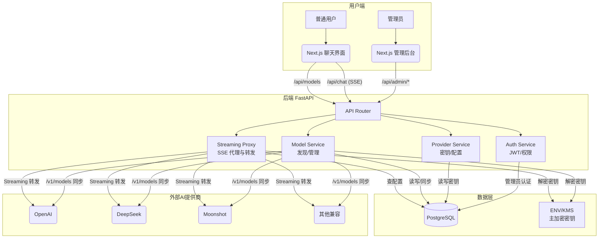
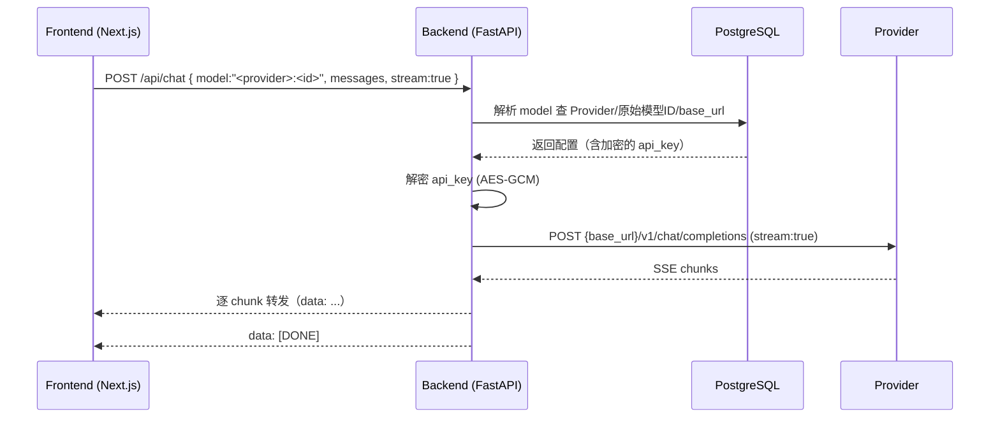
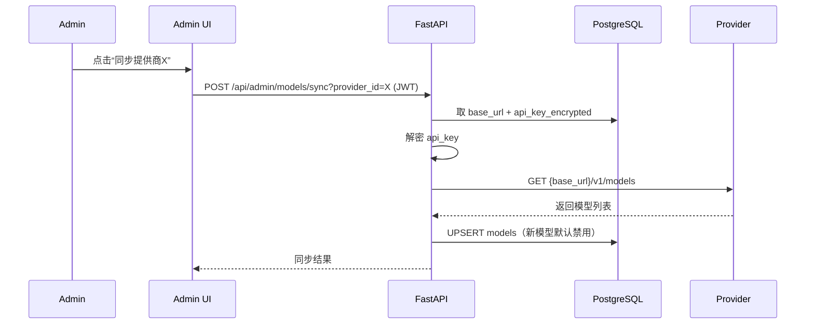

# 中文AI聊天公益平台 — 系统架构设计（权威版）

版本：v1.0（合并你的设计与我的实施细节）
状态：可执行蓝本

## 1. 目标与原则
- 高性能低延迟：优先优化 SSE 流式链路，端到端实时输出。
- 兼容与灵活：严格遵守 OpenAI API（/v1/chat/completions, /v1/models），以“OpenAI 兼容协议”为抽象。
- 安全：上游 API Key 加密存储；管理员 JWT 保护；最小权限日志。
- 可维护可扩展：前后端分离，模块化、可水平扩展；清晰数据模型与接口契约。

## 2. 技术栈
- 前端：Next.js（TypeScript）+ TailwindCSS + shadcn/ui
- 后端：FastAPI（Python 3.11+，ASGI）+ httpx（异步）+ Uvicorn
- 数据库：PostgreSQL + SQLAlchemy 2.0（Async）+ Alembic（迁移）
- 部署：Docker（本地/生产），Vercel（文档/前端可选），Nginx/Caddy（HTTPS 终止）

## 3. 架构概览

## 4. 核心数据流
### 4.1 聊天（Streaming 代理）

### 4.2 模型同步（/v1/models）

## 5. 数据库设计（MVP）
- admins
  - id (uuid), email (unique), password_hash, created_at, updated_at, last_login_at
- providers
  - id (uuid), name_slug (unique), display_name, base_url,
  - api_key_encrypted, is_active (bool), notes, created_at, updated_at,
  - last_sync_at, last_sync_status
- models
  - id (uuid), provider_id (fk), provider_model_id (text),
  - enabled (bool, default false), display_name (text), description (text), sort_order (int),
  - discovered_at, created_at, updated_at
  - unique (provider_id, provider_model_id)

备注：后续如需服务端存储会话，可增 conversations/messages 表；管理员操作可增 audit_logs。

## 6. API 契约（MVP）
- GET /api/models
  - 响应 200: [{ id: string, display_name: string, description?: string, sort_order: number }]
  - 仅返回 enabled=true 的模型；id 形如 "<provider_slug>:<provider_model_id>"

- POST /api/chat
  - 请求（OpenAI 兼容）：{ model, messages, temperature?, top_p?, stream?=true, ... }
  - 响应：
    - stream=true: SSE（data 行兼容 OpenAI delta 片段），以 data: [DONE] 结束
    - stream=false: 一次性 JSON（OpenAI 兼容 choices）
  - 错误：{ error: { code, message, details? } }

- POST /api/admin/auth/login
  - 请求：{ email, password }
  - 响应：{ access_token, token_type:"Bearer", expires_in }

- Providers 管理
  - GET/POST/PUT/DELETE /api/admin/providers（api_key 只写不读）

- 模型同步与管理
  - POST /api/admin/models/sync?provider_id=xxx
  - GET /api/admin/models（可按 provider 过滤）
  - PUT /api/admin/models/:id（enabled/display_name/description/sort_order）

## 7. 错误模型（标准化）
- 统一格式：{ error: { code: string, message: string, details?: any } }
- 常见 code：
  - MODEL_NOT_FOUND, INVALID_API_KEY, PROVIDER_UNAVAILABLE,
  - RATE_LIMITED, UPSTREAM_TIMEOUT, BAD_REQUEST
- 日志包含 request_id、provider、model、耗时、状态码（不记录明文密钥与敏感内容）。

## 8. 安全设计
- API Key 加密：AES-256-GCM；主密钥由环境变量 ENCRYPTION_KEY 注入（32 字节，Base64）。
- 管理员认证：bcrypt/argon2 哈希；JWT（短期 Access Token）。
- CORS：仅允许前端域名；Admin 路由必须校验 JWT。
- 速率限制：按 IP 进行限流（MVP 可先不启用，预留中间件接口）。

## 9. 目录结构（建议）
- frontend/
  - app/chat, app/admin/{login,providers,models}
  - components/{chat,admin}
  - lib/api.ts
- backend/
  - app/main.py, routers/{public.py,admin.py,health.py}
  - services/{proxy.py,providers.py,models_sync.py,crypto.py,auth.py}
  - db/{models.py,session.py,migrations}
  - schemas/, config.py, tests/
- docs/
  - architecture.md（本文）

## 10. 实施计划（MVP → 上线）
- MVP：
  - FastAPI 骨架 + Alembic 初始迁移
  - /api/chat（SSE 代理）+ /api/models
  - Admin 登录 + Provider CRUD + /v1/models 同步
  - Next.js 聊天页（SSE、Markdown/代码块、停止/重试、历史 localStorage）
- 完善：
  - 模型启用/禁用 + 自定义名/描述/排序（前后端联调）
  - 统一错误映射与观测（日志/指标/追踪）
  - 安全加固与限流；部署上线

## 11. Vercel 文档站（本仓库）
- 本仓库提供静态网页（index.html）自动渲染 docs/architecture.md（含 Mermaid）。
- 直接在 Vercel 新建项目指向该仓库即可自动部署为静态站点。

## 12. 环境变量（后端预留）
- DATABASE_URL, ENCRYPTION_KEY, JWT_SECRET, JWT_EXPIRES_IN, CORS_ALLOWED_ORIGINS, LOG_LEVEL, REQUEST_TIMEOUTS

—— 设计到此为“权威版蓝本”。后续如需细化任一章节，将在 docs/ 目录增量更新并配套迁移/接口变更说明。
